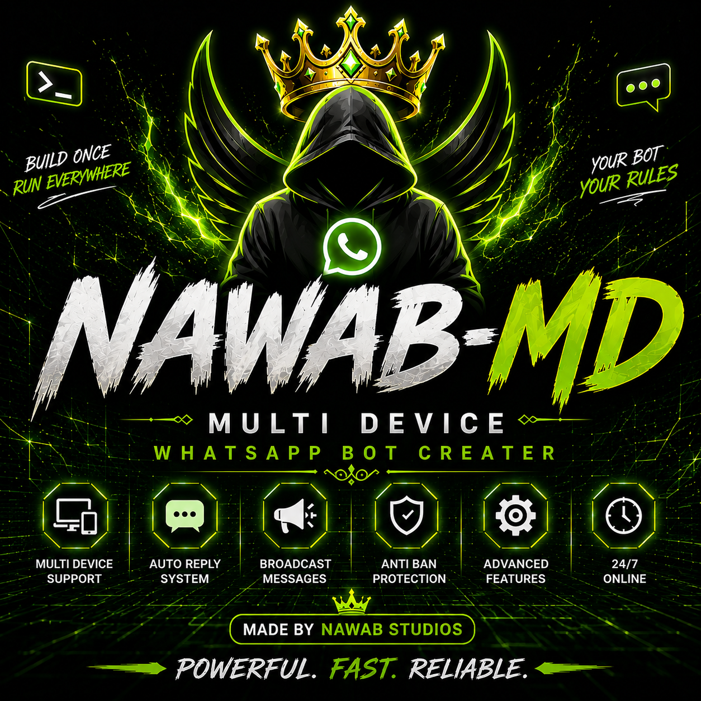

# 👑 NAWAB-MD



**Owner: NAWAB DEV**

A clean NAWAB-MD Multi-Device WhatsApp bot starter with **phone-number pairing**.

## Features

- 📱 WhatsApp phone-number pairing — no external pairing website
- 💾 Local session persistence
- 🧩 Simple plugin/command system
- 🏓 `.ping`
- 📋 `.menu`
- ℹ️ `.about`
- 🎵 `.play <song name>` with YouTube search
- 📢 NAWAB-MD WhatsApp Channel configured
- ❤️ Health endpoint for Render/Railway/Koyeb-style hosting

## 1. Install

```bash
npm install
```

## 2. Configure

Copy `.env.example` to `.env`:

```bash
cp .env.example .env
```

Set:

```env
PAIRING_NUMBER=923001234567
OWNER_NUMBER=923001234567
```

Use digits only, including the country code.

## 3. Start

```bash
npm start
```

The terminal will show a pairing code.

On the WhatsApp phone:

**Settings → Linked devices → Link a device → Link with phone number**

Enter the displayed code.

## Important

- Do not upload `.env` or the `session/` directory to GitHub.
- Never publish WhatsApp session credentials or API keys.
- The GitHub repository is configured as:
  https://github.com/mrx29800-byte/NAWAB-MD
- The WhatsApp channel is configured as:
  https://whatsapp.com/channel/0029VbDamhwGufIs5YfKmd1i

## Music download

`.play` always searches YouTube. Actual server-side audio downloading requires an authorized downloader API configured through `GIFTED_API_KEY`.

Without that key, the bot returns the YouTube result URL instead of pretending a download is available.
